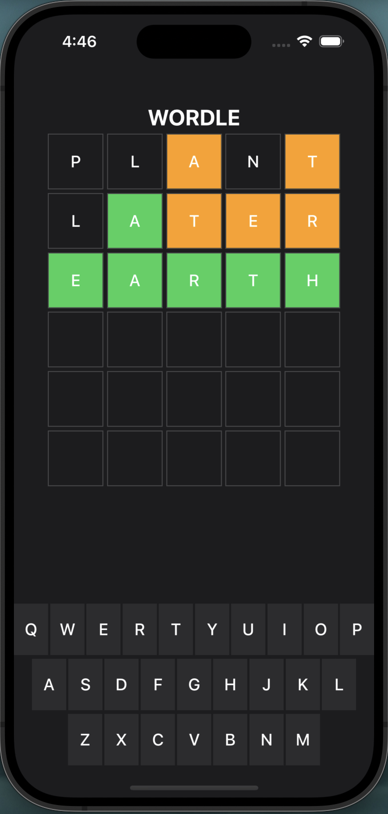

# Wordle

Welcome to Wordle - developed using the power of Swift and Xcode, Wordle is a word-guessing game that will text your skills and keep you entertained. With its sleek design and intuitive interface, Wordle offers a seamless gaming experience on your iOS device. 

## Features

- **Word Guessing:** Players can guess words by selecting letters from a virtual keyboard.
- **Feedback:** Feedback is provided on each guess, indicating correct letters and their positions.
- **Customizable:** The game can be easily customized with different words and configurations.

## Working Sample

## Installation

To run this project on your local machine, follow these steps:

1. Clone the repository to your local machine.
2. Open the project in Xcode.
3. Build and run the project on a simulator or physical device.

## Usage

- Launch the app on your device or simulator.
- Tap on the letters on the keyboard to make guesses.
- Receive feedback on your guesses and try to guess the word.

## Contributors

- Nimisha Bhagat - https://github.com/nimisha218
